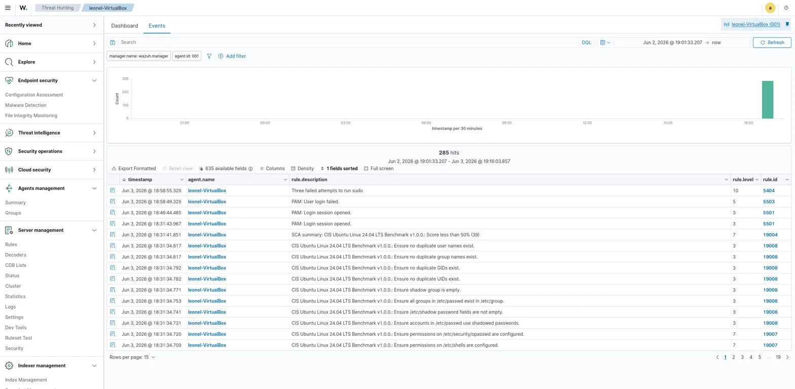
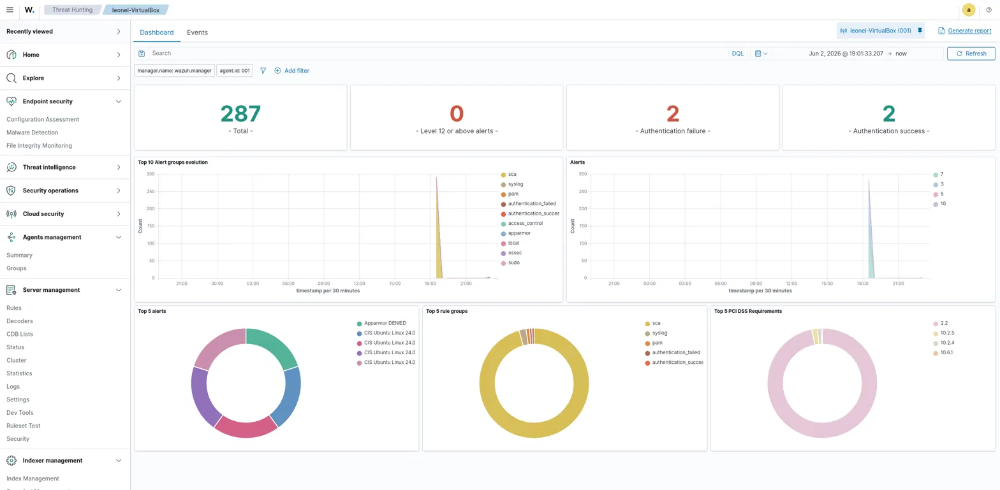

# Wazuh SIEM Home Lab

> **Disclaimer:** This is a personal lab built for learning purposes. All "attacks" are self-generated against my own virtual machine. No real systems or data are involved.

A self-hosted SIEM lab: deploying Wazuh 4.14.1 from scratch on a virtualized Ubuntu host, troubleshooting the deployment, enrolling an agent, and investigating a simulated privilege-escalation attempt end to end — the same detection workflow a SOC analyst runs daily.

## Architecture

| Layer | Component | Role |
|-------|-----------|------|
| Detection engine | Wazuh **Manager** | Parses logs, applies rules, raises alerts |
| Storage | Wazuh **Indexer** (OpenSearch) | Stores and indexes events |
| Visualization | Wazuh **Dashboard** | Web UI for hunting and triage |
| Host / endpoint | Ubuntu VM (VirtualBox) | Runs the stack in Docker **and** is the monitored endpoint via the Wazuh agent |

The three server components run as Docker containers (single-node deployment). The host VM is monitored as an endpoint through the Wazuh agent.

## Deployment

```bash
git clone https://github.com/wazuh/wazuh-docker.git -b v4.14.1
cd wazuh-docker/single-node
sudo docker compose up -d
```

Healthy stack — three containers in `Running` state:

```
OK  Container single-node-wazuh.manager-1    Running
OK  Container single-node-wazuh.indexer-1    Running
OK  Container single-node-wazuh.dashboard-1  Running
```

Dashboard reachable at `https://<vm-ip>` (self-signed cert; the browser warning is expected for a local lab). Default credentials are changed after first login.

### Prerequisites

- Docker and Docker Compose on the host.
- `vm.max_map_count = 262144` in `/etc/sysctl.conf` — the Indexer (OpenSearch) won't start below this.

## Troubleshooting log

The interesting part of any deployment is what breaks. These are the issues I diagnosed and fixed:

**1. Agent package mismatch — `.rpm` vs `.deb`**
The dashboard's "Deploy new agent" wizard generated an `.rpm` install command. On Ubuntu this fails with `rpm: command not found`, since Debian-based systems use `.deb` packages with `dpkg`. Correct install for the host:

```bash
curl -o wazuh-agent_4.14.1-1_amd64.deb \
  https://packages.wazuh.com/4.x/apt/pool/main/w/wazuh-agent/wazuh-agent_4.14.1-1_amd64.deb \
&& sudo WAZUH_MANAGER='<vm-ip>' dpkg -i wazuh-agent_4.14.1-1_amd64.deb

sudo systemctl daemon-reload \
&& sudo systemctl enable wazuh-agent \
&& sudo systemctl start wazuh-agent
```

**2. No host events until the agent was enrolled**
Right after startup, the only events present were the Manager's own **SCA / CIS Benchmark** self-checks (agent `000`). Failed `sudo` attempts run on the host weren't showing up. Reason: the host had no agent yet, so its authentication logs (`/var/log/auth.log`) were never ingested. After deploying and starting `wazuh-agent` on the host, the endpoint registered as `active` and host telemetry started flowing.

**3. Time filter blind spots**
Events appeared to be "missing" simply because the default time range was *Last 15 minutes*. Verifying host time with `date` and widening the range to *Last 24 hours* resolved it. Lesson: always reconcile the dashboard time range (and timezone — servers often run UTC) before concluding there are no events.

## Case study #1 — Failed sudo / privilege-escalation attempt

**Simulation (attacker side):** repeated failed privilege escalation from the host terminal.

```bash
sudo ls /root   # entered a wrong password 3 times in a row
```

**Detection (analyst side):** in the agent's **Threat Hunting -> Events**, the alert was captured:

- `rule.description`: *Three failed attempts to run sudo*
- `rule.level`: **10** — high-severity, must-triage
- `rule.id`: **5404**
- `rule.groups`: `authentication_failed`, `sudo`, `pam`, `syslog`

The supporting lower-level events are also visible in the same timeline, e.g. *PAM: User login failed* (`rule.id 5503`, level 5), which corroborates the failed authentication chain.



This is the Wazuh equivalent of pivoting through raw logs in Azure Data Explorer with KQL — same goal (find the malicious behavior), different tool.

### Anatomy of a Wazuh event

How I read each field when triaging:

| Field | Question it answers | Example |
|-------|--------------------|---------|
| `timestamp` | When did it happen? | `Jun 3, 2026 @ 18:56:xx` |
| `agent.name` | Which host generated it? | `leonel-VirtualBox` |
| `rule.description` | What happened, in plain language? | *Three failed attempts to run sudo* |
| `rule.level` | How serious is it (0-15)? | High = triage immediately |
| `rule.id` | Which rule fired (for tuning)? | `5404` (three failed sudo) |
| `rule.groups` | What categories does it belong to? | `sudo`, `authentication_failed` |

## Dashboard vs. Events — and filtering the noise

The **Dashboard** and **Events** tabs show the *same* data through different lenses: the Dashboard aggregates into charts for the big picture; Events is the row-by-row detail for investigation.



Top-line metrics for the monitored host:

| Metric | Value |
|--------|-------|
| Total events | 287 |
| Level 12+ alerts | 0 |
| Authentication failures | 2 |
| Authentication successes | 2 |

And the event breakdown by `rule.groups`:

| `rule.groups` | Count |
|---------------|-------|
| sca | ~280 |
| syslog | 4 |
| pam | 3 |
| authentication_success | 2 |
| authentication_failed | 1 |
| sudo | 1 |
| ossec | 1 |

The ~280 `sca` entries are routine **CIS Ubuntu Linux 24.04 LTS Benchmark v1.0.0** configuration checks (hardening posture, including an SCA summary alert flagging a score under 50%) — not attacks. They dominate the charts but are background noise for incident response.

**Analyst judgment:** the dashboard also surfaced compliance widgets like *Top 5 PCI DSS Requirements*. PCI DSS is a payment-card audit framework irrelevant to this lab; Wazuh simply cross-maps existing events to it. Recognizing this as noise and ignoring it to focus on the actual `sudo` failure is part of the job — knowing what *not* to look at.

## MITRE ATT&CK mapping

- **T1110** – Brute Force
- **T1548.003** – Abuse Elevation Control Mechanism: Sudo and Sudo Caching

## What I learned

- Standing up a multi-component SIEM (Manager + Indexer + Dashboard) with Docker and getting it healthy.
- Diagnosing deployment failures (package format, agent enrollment, time filters) instead of assuming the tool was broken.
- Enrolling an endpoint agent and confirming live telemetry.
- Reading the anatomy of an alert and separating actionable security events from compliance/configuration noise.

## Next steps

- Add Windows and pfSense endpoints for cross-platform detection.
- Build custom rules and tune `rule.level` thresholds.
- Integrate threat intelligence and document additional attack scenarios.
